# Quiz Byte Backend

## Overview
Quiz Byte is a backend system that provides a variety of quizzes in computer science and IT. It is built with Go, Oracle DB, and follows Clean Architecture principles with Domain-Driven Design. The system supports user authentication via Google OAuth, AI-powered quiz generation and evaluation, and provides personalized quiz recommendations.

## Features
- User Authentication via Google OAuth 2.0
- Category and subcategory-based quiz delivery
- AI-powered quiz generation using Gemini LLM
- LLM-based auto-grading with detailed feedback (completeness, relevance, accuracy)
- Similarity-based answer evaluation using embeddings (OpenAI/Ollama)
- User progress tracking and quiz attempt history
- Personalized quiz recommendations
- RESTful API with comprehensive error handling
- Caching support with Redis (using Port & Adapter pattern)
- Integration tests and DB migration support
- Domain-driven error handling and validation

## New Features (Recent Updates)
- **Transaction Management**: Consistent transaction handling across all service layers for data integrity
- **Database Robustness**: Enhanced NULL handling for Oracle database compatibility
- **Service Layer Improvements**: Unified service constructor patterns with transaction support
- **User Management**: Complete user authentication and profile management
- **Quiz Attempt Tracking**: Store and retrieve user quiz attempts with detailed evaluation
- **AI-Powered Evaluation**: Advanced answer evaluation using LLM with multiple scoring metrics
- **Embedding-Based Similarity**: Smart answer comparison using vector embeddings
- **Quiz Generation**: Automated quiz generation from text content using AI
- **Batch Processing**: Bulk quiz creation and management capabilities
- **Recommendation System**: Personalized quiz suggestions based on user performance

## Architecture
The project follows Clean Architecture principles with Domain-Driven Design:
- **Domain Layer**: Core business logic, entities, and interfaces
- **Service Layer**: Application use cases and business logic orchestration with transaction management
- **Repository Layer**: Data access with adapters and database abstraction
- **Handler Layer**: HTTP request handling and API endpoints
- **Infrastructure Layer**: External services (Redis, OAuth, LLM services)
- **Adapter Layer**: Integration with external services (embeddings, quiz generation)
- **Transaction Layer**: Consistent transaction boundaries across all operations

## System Architecture Diagram

```mermaid
graph TB
    subgraph "Client Applications"
        Android[Android App]
        Web[Web Browser]
        API_Client[API Client]
    end

    subgraph "Quiz Byte Backend"
        subgraph "API Server"
            Router[Fiber Router]
            AuthHandler[Auth Handler]
            QuizHandler[Quiz Handler]
            UserHandler[User Handler]
            Middleware[Auth Middleware]
        end

        subgraph "Service Layer"
            AuthService[Auth Service]
            QuizService[Quiz Service]
            UserService[User Service]
            CacheService[Answer Cache Service]
            BatchService[Batch Service]
        end

        subgraph "Domain Layer"
            QuizDomain[Quiz Domain]
            UserDomain[User Domain]
            AuthDomain[Auth Domain]
            TxManager[Transaction Manager]
        end

        subgraph "Repository Layer"
            QuizRepo[Quiz Repository]
            UserRepo[User Repository]
            CategoryRepo[Category Repository]
        end
    end

    subgraph "Batch Processing"
        BatchCmd[Batch Command]
        QuizGen[Quiz Generator]
        DataSeeder[Data Seeder]
    end

    subgraph "External Services"
        GoogleOAuth[Google OAuth 2.0]
        Redis[(Redis Cache)]
        Oracle[(Oracle Database)]
        
        subgraph "AI Services"
            Gemini[Google Gemini API]
            OpenAI[OpenAI Embeddings]
            Ollama[Ollama Local LLM]
        end
    end

    subgraph "Adapters"
        OAuthAdapter[OAuth Adapter]
        RedisAdapter[Redis Cache Adapter]
        DBAdapter[Database Adapter]
        EmbeddingAdapter[Embedding Adapter]
        LLMAdapter[LLM Evaluator Adapter]
        QuizGenAdapter[Quiz Generation Adapter]
    end

    %% Client Connections
    Android --> Router
    Web --> Router
    API_Client --> Router

    %% API Flow
    Router --> Middleware
    Middleware --> AuthHandler
    Middleware --> QuizHandler
    Middleware --> UserHandler

    %% Handler to Service
    AuthHandler --> AuthService
    QuizHandler --> QuizService
    UserHandler --> UserService

    %% Service Dependencies
    AuthService --> UserRepo
    QuizService --> QuizRepo
    QuizService --> CacheService
    UserService --> UserRepo
    CacheService --> RedisAdapter

    %% Domain Layer
    AuthService --> TxManager
    QuizService --> TxManager
    UserService --> TxManager

    %% Repository to Adapters
    QuizRepo --> DBAdapter
    UserRepo --> DBAdapter
    CategoryRepo --> DBAdapter

    %% External Service Connections
    OAuthAdapter --> GoogleOAuth
    RedisAdapter --> Redis
    DBAdapter --> Oracle
    EmbeddingAdapter --> OpenAI
    EmbeddingAdapter --> Ollama
    LLMAdapter --> Gemini
    QuizGenAdapter --> Gemini

    %% Batch Processing
    BatchCmd --> QuizGen
    BatchCmd --> DataSeeder
    QuizGen --> QuizGenAdapter
    QuizGen --> EmbeddingAdapter
    DataSeeder --> DBAdapter

    %% Service to Adapter Connections
    AuthService --> OAuthAdapter
    QuizService --> LLMAdapter
    QuizService --> EmbeddingAdapter
    
    %% Styling
    classDef clientApps fill:#e1f5fe
    classDef apiLayer fill:#f3e5f5
    classDef serviceLayer fill:#e8f5e8
    classDef domainLayer fill:#fff3e0
    classDef repoLayer fill:#fce4ec
    classDef externalServices fill:#f1f8e9
    classDef adapters fill:#e0f2f1
    classDef batchProcessing fill:#fff8e1

    class Android,Web,API_Client clientApps
    class Router,AuthHandler,QuizHandler,UserHandler,Middleware apiLayer
    class AuthService,QuizService,UserService,CacheService,BatchService serviceLayer
    class QuizDomain,UserDomain,AuthDomain,TxManager domainLayer
    class QuizRepo,UserRepo,CategoryRepo repoLayer
    class GoogleOAuth,Redis,Oracle,Gemini,OpenAI,Ollama externalServices
    class OAuthAdapter,RedisAdapter,DBAdapter,EmbeddingAdapter,LLMAdapter,QuizGenAdapter adapters
    class BatchCmd,QuizGen,DataSeeder batchProcessing
```



### Architecture Highlights

#### Clean Architecture Layers
1. **Presentation Layer** (Handlers): HTTP request/response handling
2. **Application Layer** (Services): Business logic orchestration
3. **Domain Layer**: Core business rules and entities
4. **Infrastructure Layer** (Adapters): External service integration

#### Port & Adapter Pattern
- **Ports**: Domain interfaces defining contracts
- **Adapters**: Infrastructure implementations of those contracts
- **Benefits**: Testability, flexibility, and maintainability

#### Key Components
- **Transaction Manager**: Ensures data consistency across operations
- **Cache Layer**: Redis-based caching with embedding similarity
- **AI Integration**: Multiple LLM providers for different use cases
- **Authentication**: Secure OAuth 2.0 flow with JWT tokens
- **Batch Processing**: Automated quiz generation and data seeding

## Project Structure
```
cmd/                          # Entry points
  api/                        # Main API server
  batch_add_questions/        # Batch processing tool
  migrate/                    # Database migration tool
internal/           
  adapter/                    # Infrastructure adapters
    embedding/                # Embedding services (OpenAI, Ollama)
    quizgen/                  # Quiz generation services (Gemini)
  cache/                      # Cache abstraction and Redis implementation
  domain/                     # Domain models, entities, and interfaces
    quiz.go                   # Quiz domain model with difficulty constants
    user.go                   # User domain model
    evaluator.go              # Answer evaluation interfaces
    embedding.go              # Embedding service interfaces
    quizgen.go               # Quiz generation interfaces
  repository/                 # Data access layer
    models/                   # Database models
    quiz_database_adapter.go  # Quiz data operations
    user_repository.go        # User data operations
  service/                    # Application services
    quiz.go                   # Quiz business logic
    user_service.go           # User management
    auth_service.go           # Authentication logic
    answer_cache.go           # Smart answer caching
    batch_service.go          # Batch processing
  handler/                    # HTTP handlers
    quiz.go                   # Quiz API endpoints
    user_handler.go           # User API endpoints
    auth_handler.go           # Authentication endpoints
  dto/                        # API DTOs and request/response models
  middleware/                 # HTTP middleware (auth, error handling)
  logger/                     # Structured logging
  database/                   # DB connection and migration
configs/                      # Configuration files
tests/integration/            # Integration tests
```

## Technology Stack
- **Backend**: Go 1.20+
- **Database**: Oracle Database
- **Cache**: Redis
- **Authentication**: Google OAuth 2.0
- **AI Services**: 
  - Google Gemini (Quiz Generation)
  - OpenAI (Embeddings)
  - Ollama (Local Embeddings)
- **Testing**: Testify, Integration Tests
- **Infrastructure**: Docker, Docker Compose

## Getting Started

### Prerequisites
- Go 1.20+
- Oracle Database (local/remote)
- Redis Server
- Docker & Docker Compose (recommended)
- API Keys for AI services (optional for basic functionality)

### Installation
1. Clone the repository
```bash
git clone <repository-url>
cd quize-byte
```

2. Install dependencies
```bash
go mod tidy
```

3. Set up configuration
```bash
cp config.yaml.example config.yaml
# Edit config.yaml with your settings
```

4. Start infrastructure services
```bash
docker-compose up -d  # Starts Oracle DB and Redis
```

5. Run database migrations
```bash
go run cmd/migrate/main.go
```

6. Start the API server
```bash
go run cmd/api/main.go
```

### Configuration
Key environment variables and config settings:

```yaml
database:
  user: system
  password: oracle
  host: localhost
  port: 1521
  service_name: FREE

redis:
  address: localhost:6379
  db: 0

auth:
  google:
    client_id: your-google-client-id
    client_secret: your-google-client-secret
    redirect_url: http://localhost:8080/auth/google/callback

llm:
  gemini:
    api_key: your-gemini-api-key
    model: gemini-pro

embedding:
  source: openai  # or "ollama"
  openai:
    api_key: your-openai-api-key
    model: text-embedding-ada-002
  ollama:
    server_url: http://localhost:11434
    model: nomic-embed-text
```

## Command-Line Tools

This section describes various command-line tools available in the project.

### Initial Data Seeder

This tool is used to populate the database with an initial set of categories, sub-categories, and quizzes. This is useful for setting up a new environment or for testing purposes.

**Location of the seeder command:**
`cmd/seed_initial_data/main.go`

**Location of the seed data file:**
`configs/seed_data/initial_english_quizzes.json`

**How to run the seeder:**

1.  Ensure your database is running and accessible as per the `config.yaml` settings.
2.  Make sure database migrations have been applied:
    ```bash
    go run cmd/migrate/main.go
    ```
3.  Run the seeder command from the root of the project:
    ```bash
    go run cmd/seed_initial_data/main.go
    ```

The command will log its progress to the console. It is designed to be idempotent for categories and sub-categories: it will not create duplicate categories (by name) or duplicate sub-categories (by name, within the same parent category). Quizzes are always added as new items under their respective sub-categories each time the seeder processes that sub-category; it does not check for duplicate quizzes by content.

## API Endpoints

### Authentication
- `GET /auth/google/login` - Initiate Google OAuth login (redirects to Google consent page)
- `GET /auth/google/callback` - Handle OAuth callback with authorization code and state
  - Query params: `code` (required), `state` (required)
  - Returns: JSON with `access_token` and `refresh_token`
- `POST /auth/refresh` - Refresh JWT tokens using refresh token
  - Body: `{"refresh_token": "token_value"}`
  - Returns: New `access_token` and `refresh_token`
- `POST /auth/logout` - Logout user (requires authentication)
  - Headers: `Authorization: Bearer <access_token>`
  - Returns: Logout success message

### Category Management
- `GET /categories` - Get all available quiz categories and subcategories
  - Public endpoint (no authentication required)
  - Returns: Complete category hierarchy

### Quiz Management
- `GET /quiz` - Get random quiz by subcategory
  - Query params: `sub_category` (required)
  - Optional authentication (anonymous users supported)
  - Returns: Single quiz with question and options
- `GET /quizzes` - Get multiple quizzes by subcategory
  - Query params: `sub_category` (required), `count` (optional, default 10, max 50)
  - Optional authentication (anonymous users supported)
  - Returns: Array of quizzes
- `POST /quiz/check` - Submit and evaluate quiz answer
  - Body: Quiz answer submission with AI-powered evaluation
  - Optional authentication (anonymous users supported)
  - Returns: Detailed evaluation with score, feedback, and analysis

### User Management (All Protected Routes)
- `GET /users/me` - Get user profile information
  - Headers: `Authorization: Bearer <access_token>`
  - Returns: User profile with basic information

- `GET /users/me/attempts` - Get user's quiz attempt history
  - Headers: `Authorization: Bearer <access_token>`
  - Query params:
    - `limit` (optional, default 10) - Items per page
    - `page` (optional, default 1) - Page number
    - `category_id` (optional) - Filter by category
    - `start_date` (optional, YYYY-MM-DD) - Filter from date
    - `end_date` (optional, YYYY-MM-DD) - Filter to date
    - `is_correct` (optional, true/false) - Filter by correctness
    - `sort_by` (optional, default 'attempted_at') - Sort field
    - `sort_order` (optional, ASC/DESC, default 'DESC') - Sort direction
  - Returns: Paginated list of quiz attempts with filtering

- `GET /users/me/incorrect-answers` - Get user's incorrect answers for review
  - Headers: `Authorization: Bearer <access_token>`
  - Query params: Same filtering options as attempts
  - Returns: Paginated list of incorrect answers with explanations

- `GET /users/me/recommendations` - Get personalized quiz recommendations
  - Headers: `Authorization: Bearer <access_token>`
  - Query params:
    - `limit` (optional, default 10) - Number of recommendations
    - `sub_category_id` (optional) - Filter by subcategory
  - Returns: Personalized quiz recommendations based on performance

### API Features
- **Authentication**: JWT-based authentication with Google OAuth 2.0
- **Optional Authentication**: Some endpoints support both authenticated and anonymous users
- **Pagination**: User-specific endpoints support pagination with `limit`, `page`, and `offset`
- **Filtering**: Advanced filtering options for quiz attempts and results
- **Error Handling**: Consistent error response format with detailed error codes
- **Rate Limiting**: Built-in protection against excessive API calls
- **CORS Support**: Cross-origin requests enabled for web applications

### Response Format
All API responses follow a consistent JSON structure:

**Success Response:**
```json
{
  "data": { /* response data */ },
  "status": "success"
}
```

**Error Response:**
```json
{
  "code": "ERROR_CODE",
  "message": "Human readable error message",
  "status": 400
}
```

### Authentication
Most user-specific endpoints require authentication via Bearer token:
```
Authorization: Bearer <your_jwt_token>
```

Anonymous access is supported for basic quiz functionality, allowing users to try quizzes without registration.

## API Documentation

The API is fully documented using Swagger/OpenAPI 3.0. You can access the interactive API documentation at:

```
http://localhost:8090/swagger/
```

### Swagger Features
- **Interactive Testing**: Test API endpoints directly from the browser
- **Request/Response Examples**: See example requests and responses for each endpoint
- **Authentication Testing**: Use the "Authorize" button to test protected endpoints
- **Schema Documentation**: Detailed documentation of all request/response models
- **Error Code Reference**: Complete list of error codes and their meanings

### API Versioning
- Current API version: `v1`
- Base URL: `http://localhost:8090/api`
- Versioning strategy: URL path versioning (`/api/v1/...`)

### Testing the API
1. Start the server: `go run cmd/api/main.go`
2. Visit `http://localhost:8090/swagger/`
3. Use the "Authorize" button to authenticate with your JWT token
4. Try out different endpoints with the interactive interface

## Advanced Features

### AI-Powered Answer Evaluation
The system uses LLM-based evaluation with multiple scoring metrics:
- **Score**: Overall correctness (0.0-1.0)
- **Completeness**: How complete the answer is
- **Relevance**: How relevant the answer is to the question
- **Accuracy**: Technical accuracy of the answer
- **Keyword Matching**: Important keywords found in the answer

### Smart Caching
- Embedding-based similarity search for cached answers
- Reduces redundant LLM calls for similar answers
- Configurable similarity thresholds
- Hash-based storage for multiple answer variations

### Batch Processing
- Bulk quiz generation from text content
- Automated categorization and difficulty assignment
- Progress tracking and error handling
- Suitable for content migration and bulk updates

### Quiz Recommendation System
- Analyzes user performance patterns
- Recommends quizzes based on knowledge gaps
- Considers subcategory preferences
- Adaptive difficulty progression

## Testing

### Unit Tests
```bash
go test ./internal/...
```

### Integration Tests
```bash
go test ./tests/integration/...
```

### Test Coverage
```bash
go test -cover ./internal/...
```

## Development Guidelines

### Domain-Driven Design
- Domain entities are in `internal/domain/`
- Business logic is encapsulated in services
- Repository pattern for data access
- Clean separation of concerns

### Error Handling
- Domain-specific error types
- Proper HTTP status code mapping
- Structured error responses
- Context-aware error messages

### Code Quality
- Interface-based design for testability
- Dependency injection pattern
- Comprehensive test coverage
- Proper logging and monitoring

## Deployment
The application is designed for cloud deployment with:
- Containerized services
- Environment-based configuration
- Health check endpoints
- Graceful shutdown handling

## Contributing
1. Fork the repository
2. Create a feature branch
3. Implement changes with tests
4. Submit a pull request

## License
[Add your license information]
- Contact: jaeyeong.i.dev@gmail.com